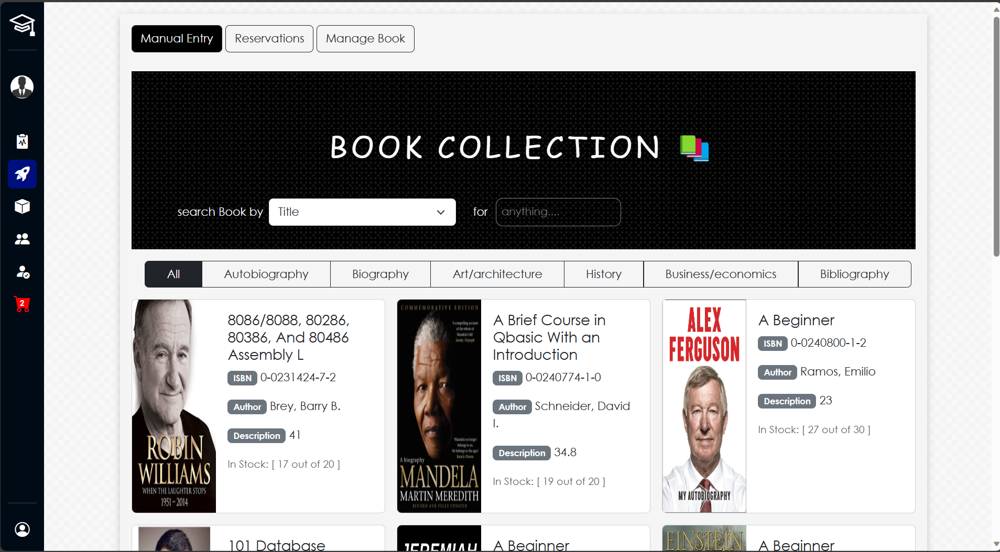

# Library Management System


## Overview

The Library Management System is a web-based application designed to streamline the operations of a library. It provides essential features for library staff, students, and faculty members to efficiently manage library resources, borrow books, return books, make reservations, and view transaction history.

## Features

### Authentication

- **User Registration:** New users can create accounts with their personal details.
- **Login:** Registered users can log in securely with their credentials.
- **Role-Based Access Control:** Different user roles, such as admin, staff, and patrons, with varying levels of access.

### Book Management

- **Add to Cart:** Users can browse and add books to their cart for later checkout.
- **Borrowing Transaction:** Users can borrow books by completing a transaction with due dates and return conditions.
- **Return Transaction:** Users can return borrowed books, with automatic updating of due dates.
- **Reservation:** Users can reserve books that are currently unavailable.

### Transaction History

- **View Transaction History:** Users can access their transaction history, including borrowed and returned books.
- **Admin Transaction Logs:** Admins can view transaction logs for all library activities for auditing and reporting purposes.

## Screenshots

Here are some screenshots of the Library Management System:





## Getting Started

### Prerequisites

- Ensure you have a compatible web browser installed.
- You need a web server environment with PHP and a database server (e.g., MySQL) installed.

### Installation

1. Clone this repository to your local environment.

```bash
git clone [https://github.com/Callmesauce/LMSPROJECT2021.git)https://github.com/Callmesauce/LMSPROJECT2021.git]
```
